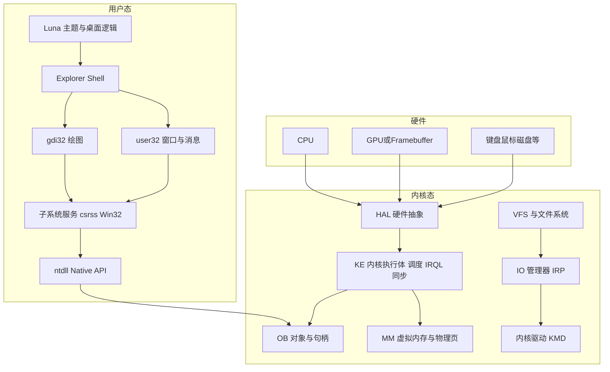

# Windows NT 型系统：内核到 Shell 的全栈说明（与本仓库边界）

本文说明 **经典 NT 架构** 自底向上的分层，并标明 **ZirconOSLuna 在本仓库中实际覆盖到哪一层**。  
本仓库以 **用户态 Shell/主题/呈现协调** 为主，并附带 **Multiboot2 最小实验内核**（非 Windows 引导链、非 `ntoskrnl`）；**不包含**真实 NT 调度器、完整 I/O 栈或 KMD 二进制。

## 总览图

## 分层职责（简要）

| 层 | 典型组件 | 职责 |
|----|----------|------|
| **HAL** | 端口、中断、计时器、DMA、映射寄存器 | 把硬件差异收拢成内核可调用原语 |
| **KE** | 调度、IRQL、DPC、APC、自旋锁、事件 | 执行环境与抢占 |
| **MM** | 页表、工作集、节、映射文件 | 地址空间与物理内存 |
| **OB** | 对象类型、句柄表、安全描述符 | 统一命名与权限 |
| **PS** | 进程、线程、作业 | 执行上下文 |
| **SE** | 令牌、SID、ACL | 访问控制 |
| **IO** | 设备栈、IRP、完成例程 | 设备与驱动模型 |
| **LPC/ALPC** | 端口消息 | 用户↔内核/服务 IPC |
| **FS** | NTFS/FAT、VCB、缓存 | 文件语义 |
| **Loader** | PE/ELF 映射、重定位、DLL | 映像加载 |
| **Win32 子系统** | csrss、kernel32、user32、gdi32 | 窗口站、桌面、GDI 设备上下文、消息泵 |
| **Shell** | Explorer、任务栏、托盘 | 外壳与策略 |

### WOW64 在栈中的位置（仅 NT 5.2 x64）

在 **64 位系统**上运行 **32 位 Win32 进程** 时，用户态会经过 **WOW64**（如 `wow64.dll`、`wow64cpu.dll` 等）把 **32 位 syscall** 转为 **64 位原生路径**，再进入 `ntdll` / 内核。WOW64 **不属于** Luna Shell 本身，但复现「完整桌面体验」时，资源与注册表 **重定向**（`SysWOW64`、`Wow6432Node`）会影响路径与兼容性。细节见 [NT52_KERNEL_ARCH_CN.md](NT52_KERNEL_ARCH_CN.md) 第四节。

### 本仓库的「引导」落点（与真实 XP x64 区分）

真实 Windows XP x64 使用 **NTLDR 系**引导链加载 **64 位内核**（见 [NT52_KERNEL_ARCH_CN.md](NT52_KERNEL_ARCH_CN.md) §6.4）。本仓库另提供 **Multiboot2** 实验内核（`boot/entry.S`、`src/kernel/entry.zig`），用于在 QEMU 等环境中验证 **x86-64 内核入口与工程习惯**，**不**等价于复刻 NTLDR/安装程序。  
引导阶段用 **2MiB 大页** 做 **低 512MiB 恒等映射**，以便 GRUB 按 ELF 将 `.text/.bss` 放到十余 MiB 物理地址时仍可执行（详见 [REPOSITORY_LAYOUT_CN.md](REPOSITORY_LAYOUT_CN.md) 内核表）。

## 本仓库（ZirconOSLuna）落点

| 层 | 本仓库是否实现 | 说明 |
|----|----------------|------|
| 引导 / arch 启动 | **实验内核** | `boot/entry.S` + Multiboot2；**非** NTLDR/Bootmgr |
| **arch/x86_64** | **常量** | `paging.zig` 4 级页表 |
| HAL | **类型与常量** | 见 `src/hal/framebuffer.zig`（面向宿主帧缓冲的契约，非内核 HAL） |
| 驱动 | **仅视频呈现侧接口** | 见 `src/drivers/video/display_manager.zig`（与脏区/合成对接，非 KMD） |
| **KE/MM/OB/PS/SE/IO/LPC** | **类型与常量** | `ke/`、`mm/`、`ob/`、`ps/`、`se/`、`io/`、`lpc/` 规范类型 |
| **Loader** | **常量** | `loader/pe.zig` PE 魔数 |
| user32/gdi32 | **否（完整实现）** | 提供 Shell 状态机、主题与 **宿主应实现的绘制/消息契约** |
| Shell/Luna 视觉与逻辑 | **是** | `src/desktop/luna/` |

结论：**“内核架构说明”** 在本文与 `docs/REPOSITORY_LAYOUT_CN.md`；**代码** 中在 `src/hal`、`src/drivers/video` 提供与 **显示管线** 相关的可编译接口，其余内核同名目录为 **架构对齐用占位与说明**，避免误以为本仓库已实现内核。

## 数据路径（呈现一条）

1. 宿主或内核侧把 **帧缓冲** 映射到用户态，或提供 **离屏缓冲 + BitBlt**。  
2. `render` 产出 **脏矩形** 与 **帧序号**。  
3. `display_manager`（驱动/视频层封装）将脏区提交给 `FramebufferSurface` 约定。  
4. Shell 模块只处理 **逻辑几何与状态**，不直接访问端口。
