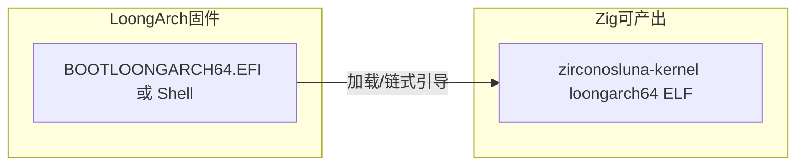

# LoongArch UEFI 引导与 ZBM：现状与改进清单

## 根因说明

1. **`-Dkernel-arch` / `KERNEL_ARCH` 只影响内核 ELF**，不切换 ZBM。仓库里真正的启动管理器实现是 [boot/zbm/main.zig](boot/zbm/main.zig)，其产物固定为 **x86_64 UEFI** → `BOOTX64.EFI`（见 [build.zig](build.zig) 中 `zbm_target`）。在 **LoongArch 固件**上必须执行 **LoongArch 的 `.efi`**，不能把 `BOOTX64.EFI` 改名当 LoongArch 用。
2. **Zig 0.15.x 无法生成 LoongArch / RISC-V 的 UEFI COFF**：`zig build-exe … -target loongarch64-uefi-msvc`（或 `riscv64-uefi-msvc`）会在链接阶段报错 `UnsupportedCoffArchitecture`。因此本仓库**不能**像 `BOOTAA64.EFI` 那样在纯 Zig 内产出 `BOOTLOONGARCH64.EFI`。
3. 若屏幕上仍出现 **「x86-64」** 字样：来自 **x86 ZBM 菜单**（本机固件即为 x86-64）或旧版 **aarch64 stub** 中误写的「x86_64 ISO 为主」提示；已与 **实际编译的 `.efi` 架构** 区分显示。

## 数据流（目标）

## 改进 To-do（按优先级）

### A. 工具链与产物（阻塞「真正 LoongArch ZBM」）

- [ ] 跟踪或参与 Zig/LLD issue：**LoongArch UEFI COFF 输出**；一旦支持，在 [build.zig](build.zig) 增加与 `BOOTAA64` 对称的 `zig build zbm-loongarch64`。
- [ ] **短期可行**：用 **gnu-efi** 或 **EDK2** 自写最小 LoongArch UEFI 应用（仅 ConOut + `LoadImage`/`StartImage` 或读 FAT 加载内核），与内核 ELF 路径约定写进 [docs/MULTI_ARCH_CN.md](MULTI_ARCH_CN.md)。
- [ ] **QEMU**：确认 `qemu-system-loongarch64` + 带 UEFI 的固件镜像路径；在脚本中增加与 `run-qemu.sh` 对称的 `run-qemu-loongarch.sh`（可选）。

### B. 构建与提示（避免误配）

- [x] `zig build` 在 `kernel-arch != x86_64` 时打印警告：ISO 仍含 x86_64 ZBM。
- [x] x86 ZBM 菜单标明 **UEFI CPU: x86-64** 与 **BOOTX64.EFI**。
- [x] 非 x86 stub 通过 `zbm_stub_config` 注入架构文案（aarch64 等）。

### C. 内核桌面（x86_64 路径上）

- [x] PS/2 鼠标轮询 + Luna 指针（与键盘字节按状态寄存器分流）。

### D. 验证

- [ ] 真机或 QEMU LoongArch：使用 **非 Zig 生成的** LoongArch UEFI 引导加载 `zirconosluna-kernel`（或 Multiboot2 等价物，若该架构采用不同引导协议需单独文档）。

## 参考（只读思路，勿照抄实现）

- [ReactOS](https://github.com/reactos/reactos) `boot/` 分层与启动顺序可作流程对照；许可为 GPL，勿复制源码。
- OSDev、EDK2 文档、LoongArch ABI 与固件约定以官方与 QEMU 发布说明为准。
